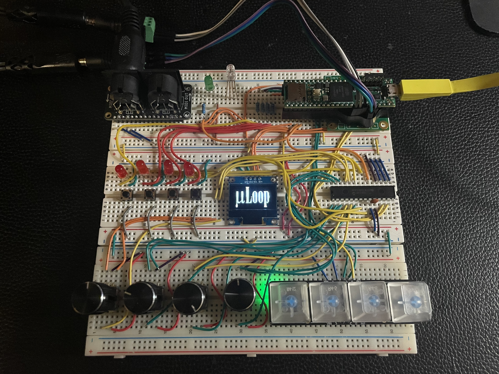

# μLoop: Live Performance Looper/Sampler

MIDI-synced micro-looper with effects, inspired by the French House and Electro sounds of *Ed Banger Records*

## Features

**Three core effects:**

- **CHOKE**: Instant audio mute with short crossfades for click-free audio
- **STUTTER**: Rhythmic buffer looping that captures and repeats a slice of incoming audio for glitchy, chopped textures
- **FREEZE**: Granular hold effect that captures and sustains a moment of audio

**Triggering modes & parameters:**

- **Free/Quantized**:Trigger effects immediately or snap onset/release to the set beat grid
- **Global Quantization**: Sets beat grid (1/4, 1/8, 1/16, 1/32 note divisions) for all quantized effect parameters
- **Onset**: Delay effect start by a set number of beats after button press
- **Length**: Automatically release effect after set beat grid length
- **Capture Start/End**: Define loop boundaries for STUTTER repetition

**System features:**

- **MIDI-synchronized timing**: Locks to external MIDI clock (24 PPQN) with jitter-smoothed beat tracking
- **Parameter/menu control**: x4 rotary encoders for real-time parameter adjustment and menu navigation
- **Visual feedback**: 128×64 OLED display shows current effect state, parameters, and menu options
- **Effect presets**: Save and recall complete parameter configurations for different performance contexts

## Architecture

**Hardware**: ARM Cortex-M7 (Teensy 4.1) + SGTL5000 audio codec, Adafruit MIDI FeatherWing, Adafruit 1x4 NeoKey, 128×64 OLED display, MCP23017 GPIO expander, 4 encoders, 4 push buttons, and some status LEDs

**Software**: Custom CMake build system, C++17, zero-allocation DSP engine

**Threading model**: Deterministic multithreaded architecture with:
- High-priority audio ISR (44.1kHz, 128-sample blocks)
- 5 control threads (MIDI I/O, input polling, display updates, encoder handling, app logic)
- Lock-free SPSC queues for non-blocking inter-thread communication

**Key components**:
- Custom SGTL5000 register-layer driver (I²C codec configuration)
- TimeKeeper: Centralized timing authority bridging MIDI clock and audio samples
- Sample-accurate quantization API for beat/bar-aligned recording and playback
- Effect system with polymorphic command dispatch

**Real-time safety**: No dynamic allocation in audio path, wait-free data structures

## Technical Highlights

- **Sub-millisecond effect latency**: ISR state capture with 64-event ring buffer (~26us response time)
- **Professional timing**: EMA-smoothed MIDI clock with atomic beat boundary detection
- **Click-free audio**: 3ms linear crossfades on all effect transitions
- **Zero missed steps**: Hardware-frozen encoder state via MCP23017 INTCAP registers
